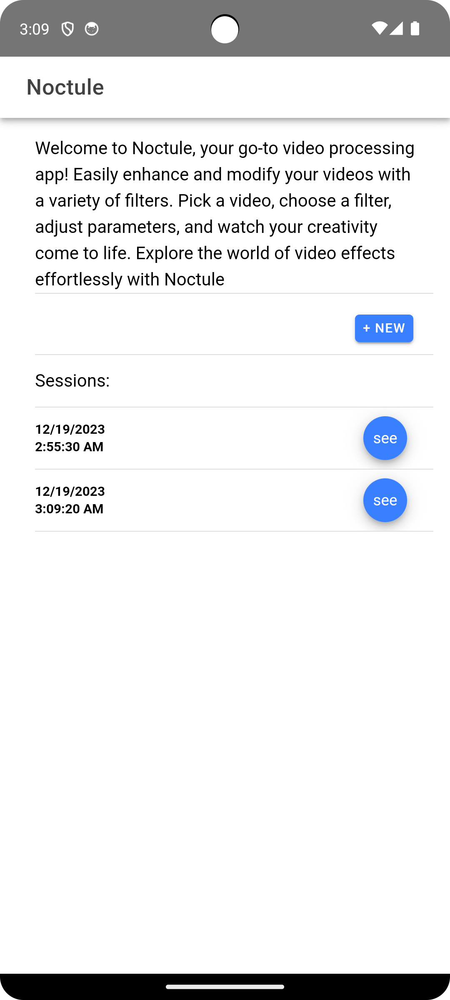
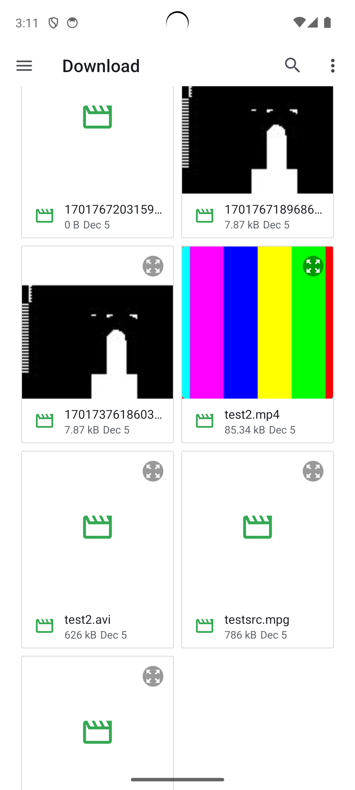
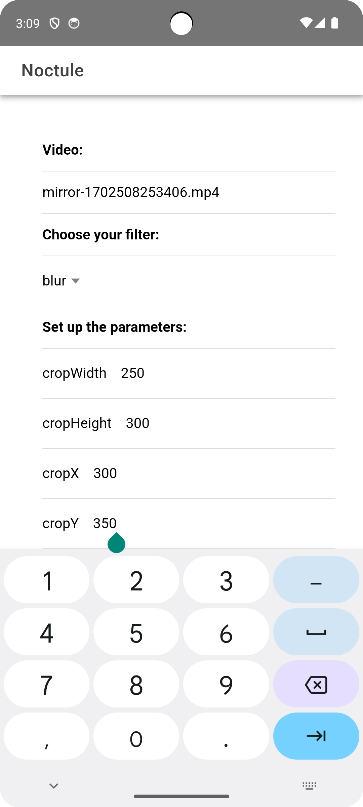
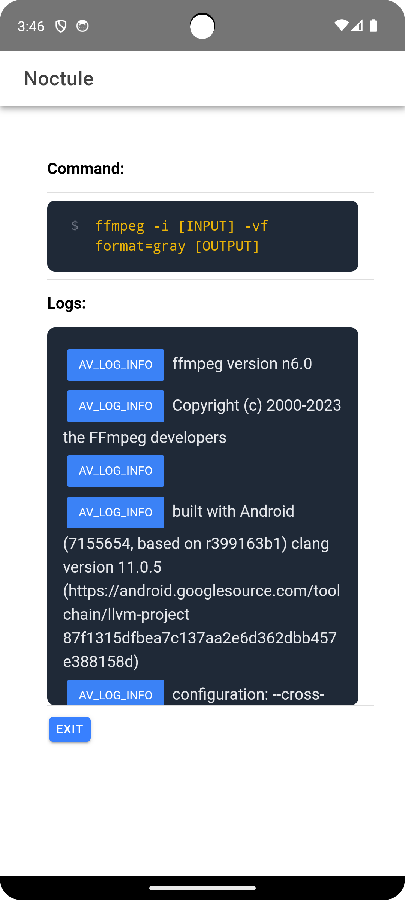

# Noctule - Android Video and Image Manipulation with FFmpeg ✨

**Noctule** is an Android app designed for manipulating videos and images using **FFmpeg** filters. It does not require an internet connection and serves both educational purposes for learning FFmpeg and practical use for processing videos and images directly on your device. The project is in its early stages of development, and contributions are welcome.

## Features

- 🎥 Video and image manipulation with FFmpeg filters
- 🎨 GUI for setting FFmpeg command parameters
- ▶️ Execution of FFmpeg commands
- 📋 Display of the actual executed command
- 🕰️ History of previous commands
- 📺 Playback of video or image results COMING

## Release

For the latest release and version history, please visit the [Releases](https://github.com/phoebus-84/Noctule/releases) page on GitHub.

**Note: All releases are currently in alpha stage. Use with caution in a controlled environment.**


## Screenshots

## Screenshots

1. **Main Page**
   

2. **File Picker**
   

3. **Filter Customizations**
   

4. **Results**
   


## Installation

To install locally, follow these steps:

```bash
git clone https://github.com/phoebus-84/Noctule.git
cd Noctule
npm install -g @ionic/cli
pnpm install
pnpm android
```
## Roadmap

- [ ] **CapacitorJS Plugin Development**
  - [ ] Create CapacitorJS plugin for Noctule
  - [ ] Bridge all FFmpeg-kit API to JavaScript
  - [ ] Test and ensure functionality on Android devices

- [ ] **Advanced Operations**
  - [ ] Implement operations on two or many inputs
  - [ ] Integrate audio operations with FFmpeg filters
  - [ ] Real-time statistics for ongoing operations

- [ ] **Customization**
  - [ ] Allow the creation of custom filters or commands
  - [ ] Provide a user-friendly interface for defining custom filters
  - [ ] Execute and display results of user-created commands

- [ ] **Enhancements**
  - [ ] Improve user interface
  - [ ] Implement importable filter packs for easy usage

- [ ] **Testing and Stability**
  - [ ] Conduct extensive testing on various Android devices
  - [ ] Address and fix any stability issues
  - [ ] Optimize resource usage for better performance

- [ ] **Release**
  - [ ] Release stable version of the Noctule app with new features
  - [ ] Publish CapacitorJS plugin to npm for broader use

## Contributing

Contributions to Noctule are welcome and encouraged. To contribute to the project, please follow these steps:

1. Fork the repository.
2. Create a new branch for your feature or bug fix: `git checkout -b feature-name`.
3. Make your changes and commit them: `git commit -m 'Add new feature'`.
4. Push to your branch: `git push origin feature-name`.
5. Submit a pull request.

Please adhere to our [code of conduct](code-of-conduct.md) when contributing.

## License

Noctule is licensed under the [MIT License](https://choosealicense.com/licenses/mit/). 

